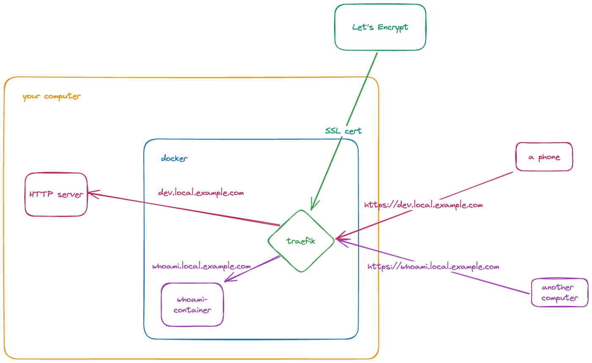

# localssl
Equip local dev server with a CA-signed SSL certificate.

## What is this?

This will enable your local HTTP server to be reachable at a global domain name instead of localhost, e.g. local.example.com, with a valid CA-signed SSL certificate. This is helpful when you need to reach your local server from another device in the same local network _and_ SSL is enabled. A self-signed SSL certificate is not helpful because the cert is only valid on the machine where the server runs.

The idea is borrowed from this [blogpost](https://www.codinginfinity.me/posts/reverse-proxy-yourself-to-localhost-with-ssltls/), but traefik is used as reverse proxy instead of nginx-proxy because traefik handles SSL request and renewal automatically.

## How does it work?
This is inherently just how traefik (or any other reverse proxy) works. The special bit is that instead of your domain pointing to a public IP, it points to a local IP.


## Instruction

0. Get a domain name
1. Get the local IP address of the machine where the HTTP server will run. On macOS, this is in Settings -> Networks -> Details of the active network -> IP address.
2. Set an `A` record at the desired host on this IP address in your DNS provider's settings. For instance, if you own the domain `example.com` and want your local server running on machine `192.168.0.213` to be reachable at `local.example.com`, set these two records:
```
A local 192.168.0.213
A *.local 192.168.0.213
```
The second one is optional but practical when you have multiple services running and don't want to set a record for each of them.

3. In `docker-compose.yml`, replace all instances of `your-domain.com` with the one that you set the DNS records for, e.g. `local.example.com`. Also replace `CF_API_KEY` and `CF_API_EMAIL` value with your credentials for Cloudflare. If you have another provider, follow this [instruction](https://doc.traefik.io/traefik/https/acme/#providers).

4. Go to `traefik.yml`, update `certificatesResolvers.myresolver.acme.dnsChallenge.provider` if needed
5. Go to `traefik-dynamic.yml`, update the host at `http.routers.to-dev-server.rule` and update the port at `services.dev-server.loadBalancer.servers[0].url` to the port of your local server
6. Run `docker compose up`. It takes a bit to request a SSL certificate and then your local server should be reachable at the desired host.